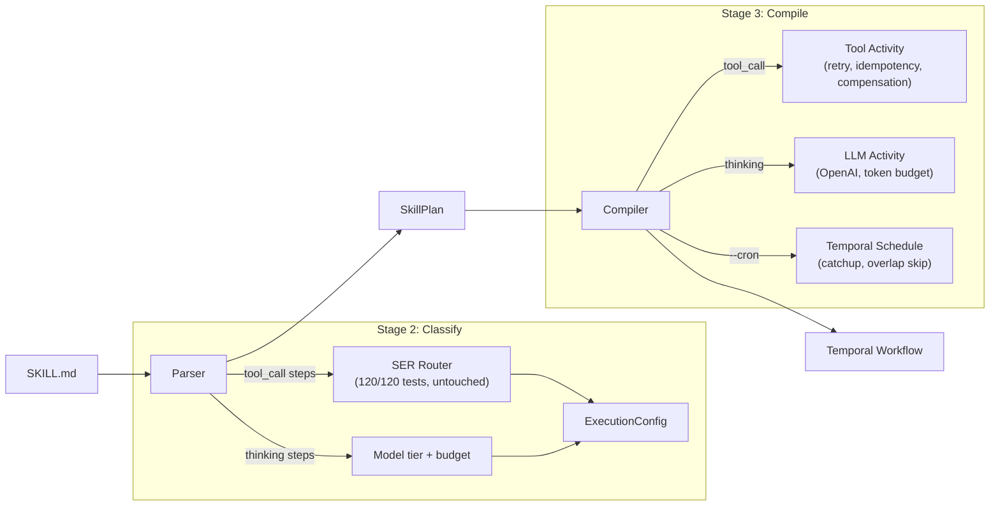

# SKILL.md-to-Temporal Compiler Implementation

## Architecture

The pipeline has one job: random skill in, durable execution out.



## Decisions locked

- **Frontmatter**: support both `execution:` block and `metadata: tenure.*` flat encoding, taxonomy as final fallback
- **Thinking steps**: full support; heuristic identification (tool reference = tool_call, everything else = thinking)
- **LLM provider**: OpenAI SDK directly
- **Test framework**: vitest
- **Adapter**: move `src/adapter/` to `src/adapter/openclaw/`
- **README**: rewrite with `tenure run` framing included in this pass

## Reference patterns from tenure-research

Three implementations in `/Users/priyankalalge/tenure-research` have solved subsets of this problem. We reuse their patterns, not their code.

### Zeitlich (`zeitlich/src/lib/skills/parse.ts`) -- frontmatter parsing

- `parseSkillFile(raw)` uses regex `---` delimiter extraction + custom `parseSimpleYaml` with zero external dependencies
- Handles BOM stripping, `allowed-tools` (space-delimited to array), one-level `metadata` map
- **Limitation**: only supports one-level nesting. Our `execution:` block has deeper structure (`execution.retry`, `execution.idempotency.key`), so we still need `gray-matter` for full YAML. But the `SkillMetadata` shape (name, description, allowedTools, metadata) is directly reusable as our base type before adding execution fields.
- **Reuse**: mirror the `SkillMetadata` interface shape; mirror the BOM-strip + validation (name/description required)

### temporal-ai-agent (`activities/tool_activities.py`) -- dynamic activity dispatch

- `dynamic_tool_activity` with `@activity.defn(dynamic=True)`: activity type name = tool name at runtime
- `workflow_helpers.execute_activity(tool_name, args, ...)`: dispatches by string name with per-tool retry policy, timeout, and optional task queue
- **Reuse for compiler**: our `activity-dispatch.ts` should use one generic `executeSkillStep` Activity that dispatches by tool name from the SkillPlan, not generate per-tool Activity classes. The `ExecutionConfig` from our SER router maps directly to the `retry_policy` + `timeout` + `schedule_to_close_timeout` parameters in the Python pattern.

### Zeitlich (`src/lib/model/proxy.ts`) -- LLM activity proxy

- `proxyRunAgent(scope?)` creates a workflow-safe activity proxy with LLM-appropriate defaults: `startToCloseTimeout: '10m'`, `heartbeatTimeout: '1m'`, retry `maximumAttempts: 3`, `backoffCoefficient: 3`
- Naming convention: `run<Scope>` where scope defaults to `workflowInfo().workflowType`
- **Reuse for thinking steps**: our thinking activity proxy should follow identical defaults. The scope convention maps to our skill name: `think<SkillName>` or just a generic `thinkingActivity` since we parameterize by SkillPlan.

### What none of them do (our gap to fill)

Neither zeitlich nor temporal-ai-agent implements **workflow codegen from markdown**. Zeitlich stays runtime interpretation (ReadSkill tool + SkillProvider). temporal-ai-agent uses a single hand-coded workflow with dynamic tool dispatch. Tenure's compiler is the missing piece: SKILL.md IR to generated Temporal Workflow with classified execution semantics per step.

## Phase 1: Foundation (parallel, no dependencies)

### 1a. Dependencies and adapter move

- Add to package.json: `vitest`, `openai`, `gray-matter` (YAML frontmatter), `@types/gray-matter`
- Move `src/adapter/*.ts` to `src/adapter/openclaw/` (5 files: index.ts, session.ts, tool-registry.ts, types.ts, wrap-tool.ts)
- Update any imports referencing `src/adapter/` (client.ts, workflows, e2e script)
- Add vitest config, update `package.json` scripts: `"test": "vitest run"`, `"test:watch": "vitest"`

### 1b. Test fixtures

Create `test/fixtures/sample-skills/` with 5+ SKILL.md files of varying complexity:
- `cron-log-skill/SKILL.md` (from PIVOT-HANDOFF, tool_call only, `execution:` block)
- `web-search-skill/SKILL.md` (idempotent_read, simple)
- `deploy-skill/SKILL.md` (mixed tool_call + thinking steps, critical_transaction)
- `data-pipeline-skill/SKILL.md` (multiple tool types, `metadata: tenure.*` format)
- `browser-automation-skill/SKILL.md` (stateful_session, heartbeat)

## Phase 2: Parser (Task 4A) -- critical path

**Location**: `src/parser/`

### Files

- **`types.ts`** -- `SkillStep`, `SkillPlan`, `ExecutionBlock` interfaces. `SkillStep.type` is `'tool_call' | 'thinking'`. Content hash as `version`.
- **`frontmatter.ts`** -- Uses `gray-matter` to extract YAML. Normalizes both formats:
  - `execution:` block (structured, preferred)
  - `metadata: tenure.*` keys (flat, agentskills.io compat)
  - Returns unified `ExecutionBlock` or null
- **`steps.ts`** -- Walks markdown body. Numbered list items or headings become steps. Identification heuristic:
  - Step references a tool from `allowed-tools` frontmatter OR matches a tool name in taxonomy (`taxonomySize()` > 0 match) = `tool_call`
  - Everything else = `thinking`
  - Calls `classify(toolName, params)` from existing `src/router/` for each tool_call step
  - Assigns `modelTier` and `tokenBudget` from execution block defaults for thinking steps
- **`version.ts`** -- SHA-256 content hash of the raw SKILL.md file. This is the pin mechanism.
- **`index.ts`** -- Entry: `parse(skillPath: string): Promise<SkillPlan>`. Reads file, extracts frontmatter, walks steps, classifies, returns frozen plan.

### Key constraint
`parse()` is deterministic. Same file = same SkillPlan. No network calls, no randomness, no timestamps in the plan itself. This is critical for Temporal replay correctness.

### Tests (`test/parser.test.ts`)
- Parse each of the 5 fixture skills, verify step counts and types
- Verify determinism: parse twice, deep-equal
- Verify both frontmatter formats produce equivalent ExecutionBlock
- Verify unknown tools get `side_effect_mutation` default from router
- Verify thinking step identification heuristic

## Phase 3: Compiler (Task 4B) -- depends on parser

**Location**: `src/compiler/`

### Files

- **`activity-dispatch.ts`** -- Maps `ExecutionConfig` to Temporal `ActivityOptions` (retry policy, timeout, idempotency key). Follows the temporal-ai-agent pattern: one generic `executeSkillStep` Activity that dispatches by tool name from the SkillPlan, not per-tool Activity classes. The `ExecutionConfig` from SER maps to `startToCloseTimeout`, `retryPolicy`, and optional `heartbeatTimeout`.
- **`thinking-activity.ts`** -- New Activity: calls OpenAI with the thinking prompt + previous step results as context. Follows zeitlich's `proxyRunAgent` defaults: `startToCloseTimeout: '10m'`, `heartbeatTimeout: '1m'`, retry `maximumAttempts: 3`. Respects `modelTier` (frontier=gpt-4o, mid=gpt-4o-mini, cheap=gpt-3.5-turbo) and `tokenBudget`. Returns structured result with token usage.
- **`workflow-builder.ts`** -- Takes `SkillPlan.steps[]`, generates a sequential Temporal Workflow function. Each step dispatches via `proxyActivities` with per-step `ActivityOptions` derived from the step's `ExecutionConfig`. Thinking steps receive accumulated context from prior steps. Budget check before each dispatch (hooks into `src/budget/`). The workflow is generic and data-driven -- parameterized by SkillPlan, not code-generated per skill.
- **`schedule-builder.ts`** -- If `--cron` flag: wraps the Workflow in a `client.schedule.create()` with `catchupWindow: '10m'`, `overlap: 'SKIP'`. Returns ScheduleHandle.
- **`index.ts`** -- Entry: `compile(plan: SkillPlan, options?: CompileOptions): Promise<WorkflowHandle>`. Builds workflow, optionally wraps in schedule, starts execution, returns handle.

### Workflow registration
The compiler registers a single `skillExecutionWorkflow` with the Temporal Worker (update `src/temporal/worker.ts`). This is a generic, data-driven workflow -- it takes a `SkillPlan` as input and executes its steps sequentially. No per-skill workflow generation needed. This mirrors temporal-ai-agent's single `AgentGoalWorkflow` that handles all goals via dynamic dispatch, and zeitlich's `defineWorkflow` that wraps session config into a named workflow function.

### Activity registration
Two activity types registered on the Worker:
- `executeSkillStep` -- generic tool dispatch (mirrors temporal-ai-agent's `dynamic_tool_activity`)
- `executeThinkingStep` -- LLM invocation (mirrors zeitlich's `runAgent` pattern)

### Tests (`test/compiler.test.ts`)
- Compile the cron-log-skill fixture, verify Workflow starts
- Compile with `--cron`, verify Schedule is created
- Verify SkillPlan version hash is embedded in Workflow metadata
- Verify thinking Activity calls OpenAI (mocked)

## Phase 4: CLI and integration (parallel after compiler)

### CLI rewrite (`src/cli/index.ts`)

Replace stubs with real implementations:

```
tenure run ./skill/SKILL.md           --> parse() + compile() + execute
tenure run --cron "*/5 * * * *" ...   --> parse() + compile() + schedule
tenure scan ./skills                  --> walk dir, parse frontmatter, classify, table output
tenure certify --demo cron            --> run cron-log-skill on schedule, kill/restart, verify
tenure certify --ci                   --> crash-recovery + no-duplicate tests
tenure create                         --> exit with "Deferred to post-launch. Use skill-creator."
```

### Scanner reframe (`src/scanner/index.ts`, Task 7)

The scanner now uses the parser's frontmatter extraction. Walk directory, find SKILL.md files, parse each, output classification table. The existing `classify()` from `src/router/` does the heavy lifting.

### Cron demo reframe (`src/certify/`, Task 5)

`certify --demo cron` now runs `test/fixtures/cron-log-skill/SKILL.md` through the full pipeline:
1. `parse()` the fixture
2. `compile()` with cron schedule (every 60s for demo, configurable)
3. Run 3 cycles, SIGKILL Worker, wait, restart, verify

Same 6-line proof, cleaner setup. No OpenClaw dependency.

### No-duplicate test (Task 6)

Same structure as before but triggered via a SKILL.md that produces 100 sequential file writes. Compile, run, kill at random point, restart, verify exactly 100 files.

## Phase 5: README rewrite

Update `README.md` with the PIVOT-HANDOFF framing:
- Hero: "SKILL.md-to-Temporal compiler" not "Durable execution for OpenClaw"
- Quick start: `npx tenure run ./my-skill/SKILL.md`
- Cron quick start: `npx tenure run --cron "*/5 * * * *" ./my-skill/SKILL.md`
- Keep OpenClaw adapter visible: "Also includes an OpenClaw adapter for transparent integration"
- Keep research section, issue citations, comparison table
- Update project structure to show `src/parser/`, `src/compiler/`, new CLI surface

## Files changed summary

**New files (12):**
- `src/parser/index.ts`, `frontmatter.ts`, `steps.ts`, `types.ts`, `version.ts`
- `src/compiler/index.ts`, `workflow-builder.ts`, `activity-dispatch.ts`, `thinking-activity.ts`, `schedule-builder.ts`
- `test/parser.test.ts`, `test/compiler.test.ts`
- 5 SKILL.md fixtures under `test/fixtures/sample-skills/`
- `vitest.config.ts`

**Moved files (5):**
- `src/adapter/*.ts` --> `src/adapter/openclaw/*.ts`

**Modified files (6):**
- `package.json` (deps, scripts)
- `src/cli/index.ts` (new command surface)
- `src/scanner/index.ts` (use parser)
- `src/certify/index.ts` (reframe demos)
- `src/temporal/worker.ts` (register skill-execution workflow)
- `README.md` (new framing)

**Untouched:**
- `src/router/*` (120/120 tests, decoupled, no changes)
- `src/budget/*` (called from compiler, no changes)
- `taxonomy/*` (consumed by parser via router, no changes)
