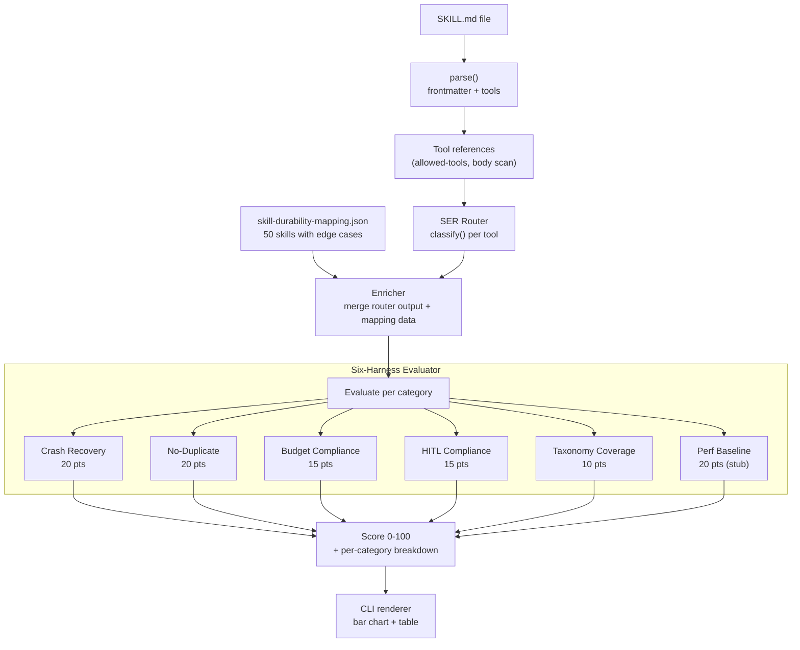

# Skill Durability Score Engine

## What it does

`npx tenure score ./my-skill/SKILL.md` reads a skill, classifies it through the SER router, evaluates it against the Six-harness criteria from [Six-harness.md](Six-harness.md), enriches with data from [output/skill-durability-mapping.json](output/skill-durability-mapping.json), and produces a 0-100 durability score with per-category breakdowns.

For known skills (the 50 in skill-durability-mapping.json), the scorer uses the rich research data: edge cases, conditional classification trees, classification confidence, execution blocks. For unknown skills, it falls back to SKILL.md parsing + taxonomy lookup + heuristic deductions.

## Scoring model (from Six-harness.md)

```
Category               Harnesses         Points   How static analysis scores it
──────────────────────────────────────────────────────────────────────────────────
Crash Recovery         1-5               20       Execution type classified? Retry policy defined? Compensation declared?
No-Duplicate           2                 20       Idempotency key strategy present? Side-effect tools have dedup config?
Budget Compliance      5+6               15       Token budget declared? ThinkingCost classified? Long-running has child budget?
HITL Compliance        4+6               15       Critical transactions gated? Human-interactive uses signal/wait?
Taxonomy Coverage      all               10       All tools classified? Classification confidence above threshold?
Perf Baseline          historical        20       Has 5+ successful runs? (Always 0 for static-only, stub for future)
──────────────────────────────────────────────────────────────────────────────────
Total                                   100
```

Max achievable from static analysis alone: **80/100** (Perf Baseline requires runtime history).

## Data flow



## Location: `src/scorer/`

```
src/scorer/
  types.ts            -- ScoreResult, CategoryScore, SkillAnalysis interfaces
  knowledge-base.ts   -- Load + index skill-durability-mapping.json; lookup by skill name
  evaluator.ts        -- Six category scoring functions, each returns points + findings
  renderer.ts         -- CLI output: score bar, category table, findings, recommendations
  index.ts            -- Entry: score(skillPath) -> ScoreResult
```

## Key files to reference

- **[output/skill-durability-mapping.json](output/skill-durability-mapping.json)**: 50 skills with `execution_block`, `edge_cases`, `conditional_classification_tree`, `classification_confidence`, `static_classification_sufficient`, `runtime_inference_required`. This is the primary knowledge base.
- **[output/crash-recovery-matrix.json](output/crash-recovery-matrix.json)**: 21 crash points with `temporal_primitive`, `replay_safe`, `idempotency_required`. Used to evaluate crash recovery posture.
- **[Six-harness.md](Six-harness.md)**: The scoring rubric (already quoted above).
- **[src/parser/index.ts](src/parser/index.ts)**: Existing parser for SKILL.md frontmatter + step extraction.
- **[src/router/index.ts](src/router/index.ts)**: Existing SER router `classify()`.

## Category scoring logic (the core of the engine)

### 1. Crash Recovery (20 points)

For each tool referenced in the skill:
- Tool is classified by SER router? (+3 per tool, up to 12)
- Execution type has a defined Temporal primitive in the mapping? (+2 per tool, up to 4)
- Retry policy is non-default (not the SAFE_DEFAULT 1-attempt)? (+2)
- Compensation handler declared for mutation/critical types? (+2)

Deductions:
- Tool classified as `side_effect_mutation` but no idempotency strategy: -3
- `runtime_inference_required: true` but no conditional tree: -2

### 2. No-Duplicate (20 points)

- All side-effect tools have idempotency key strategy? (+8)
- All side-effect tools have `idempotent: true` or `idempotencyKeyField` in config? (+6)
- No tools classified with the SAFE_DEFAULT (all explicitly known)? (+4)
- Classification confidence >= 0.9 for all tools? (+2)

Deductions:
- Any tool with `primary_classification_confidence < 0.7`: -4
- Side-effect mutation with no compensation declared: -2

### 3. Budget Compliance (15 points)

- `thinkingCost` classified for all tools? (+5)
- No `high` thinking cost without token budget declared? (+4)
- Long-running process tools have child workflow strategy? (+3)
- Execution block declares explicit cost tier? (+3)

### 4. HITL Compliance (15 points)

- All `critical_transaction` tools have `hitl: required`? (+8)
- Conditional trees include HITL escalation for dangerous edge cases? (+4)
- Human-interactive tools use signal/wait pattern? (+3)

### 5. Taxonomy Coverage (10 points)

- All tools found in taxonomy OR have explicit execution block? (+5)
- Classification source is `conditional` or `taxonomy` (not `default`) for all tools? (+3)
- `static_classification_sufficient: true` for all tools, OR runtime signals documented? (+2)

### 6. Perf Baseline (20 points) -- stub

Always 0 in static analysis mode. Future: query Temporal for historical Workflow execution data.

## CLI output format

```
npx tenure score ./my-skill/SKILL.md

[tenure score] Analyzing: ./my-skill/SKILL.md
[tenure score] Skill: slack
[tenure score] Tools referenced: 1 (slack)
[tenure score] Knowledge base: KNOWN (50-skill mapping)

┌─────────────────────────────────────────────────┐
│  SKILL DURABILITY SCORE                         │
│                                                 │
│  slack                          62 / 100        │
│  ████████████████░░░░░░░░░░                     │
│                                                 │
│  Crash Recovery        ✓  16/20                 │
│  No-Duplicate          ✓  14/20                 │
│  Budget Compliance     ✓  12/15                 │
│  HITL Compliance       ✗   5/15                 │
│  Taxonomy Coverage     ✓   8/10                 │
│  Perf Baseline         ·   0/20  (needs runs)   │
│                                                 │
│  Status: PARTIALLY DURABLE · not yet tenured    │
└─────────────────────────────────────────────────┘

  Findings:
  - sendMessage action is side_effect_mutation but no idempotency key declared (-4)
  - deleteMessage action is destructive but hitl is 'none' — should be 'recommended' (-5)
  - No execution: block in SKILL.md frontmatter — using taxonomy defaults

  Recommendations:
  - Add execution: block to SKILL.md frontmatter with type + idempotency config
  - Add hitl: recommended for deleteMessage action
  - Run: tenure run ./slack/SKILL.md 5 times to build Perf Baseline (+20 pts)
```

## Batch mode for the demo

```
npx tenure score /Users/priyankalalge/tenure-research/openclaw/skills

[tenure score] Scanning 53 skills...

  Skill                   Score   Status
  ──────────────────────────────────────
  1password               42/100  FRAGILE
  apple-notes             38/100  FRAGILE
  bear-notes              40/100  FRAGILE
  ...
  github                  71/100  PARTIALLY DURABLE
  slack                   62/100  PARTIALLY DURABLE
  ...

  Summary: 53 skills · avg 48/100 · 0 DURABLE · 12 PARTIALLY · 41 FRAGILE
  
  Top finding: 41 of 53 skills have NO execution contract.
  This means every tool call gets the same retry policy.
  A web search and a Stripe charge should not have the same retry policy.
```

This is the demo slide. "Here are 53 real OpenClaw skills. Average durability score: 48/100. Here's what changes when you add Tenure."

## Status labels

- **DURABLE** (80-100): All harnesses pass. Ready to tenure.
- **PARTIALLY DURABLE** (50-79): Most categories pass. Specific gaps identified.
- **FRAGILE** (0-49): Missing execution contract, unclassified tools, or critical HITL gaps.

## What this does NOT include (explicit deferrals)

- No Temporal server required (static analysis only)
- No `tenure run` integration (Perf Baseline is a stub)
- No LLM calls (purely deterministic scoring)
- No modification of the SKILL.md files (read-only analysis)

## Tests

`test/scorer.test.ts`:
- Score each of the 5 existing fixtures, verify per-category breakdown sums correctly
- Score a skill known to be in skill-durability-mapping.json, verify enrichment data is used
- Score a completely unknown skill, verify it still gets a score (via SAFE_DEFAULT path)
- Verify max static score is 80 (Perf Baseline always 0)
- Verify status labels match thresholds
- Batch mode: score the 5 fixtures directory, verify summary stats
