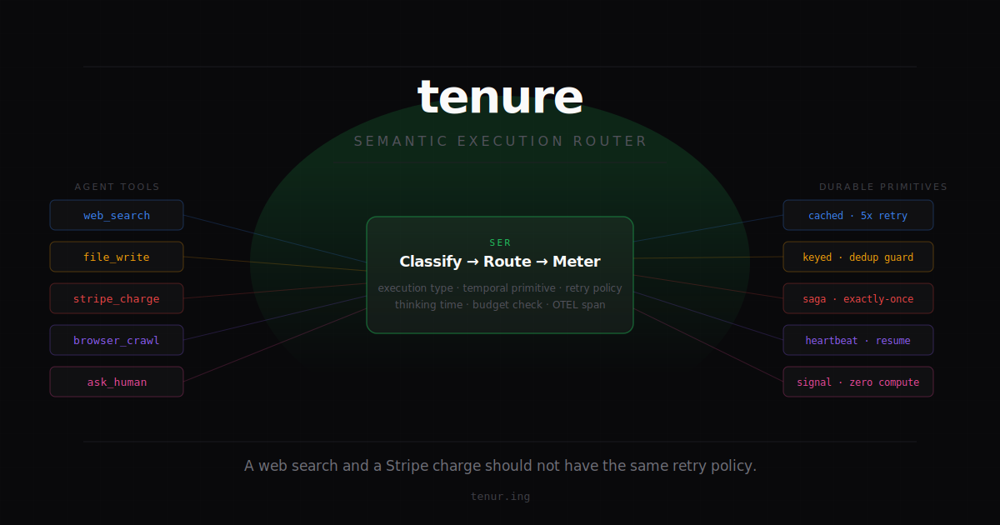

# tenure

<p align="center">
  
</p>

<p align="center">
  <strong>tenure</strong>
</p>

<h3 align="center">A web search and a Stripe charge should not have the same retry policy.</h3>

<p align="center">
  SER-first OSS wedge for OpenClaw.<br/>
  OpenClaw thinks. Tenure executes.
</p>

<p align="center">
  <a href="./RESEARCH-SETUP.md">Research Setup</a> ·
  <a href="./TAXONOMY.md">Taxonomy Draft</a> ·
  <a href="./tenure-deep-research-brief.md">Deep Research Brief</a> ·
  <a href="https://github.com/openclaw/openclaw/issues/10164">OpenClaw Issue #10164</a>
</p>

<p align="center">
  
  
</p>

---

## What This Repo Is Proving

`tenure` is building a Semantic Execution Router for OpenClaw.

The current wedge is narrow on purpose:

- prove the OpenClaw adapter boundary
- prove that execution belongs on the Temporal timeline
- prove that replay does not duplicate side effects
- prove that cron survives Worker death
- prove that budget caps stop runaway spend
- prove that circuit breakers stop pathological loops

This repo is **not** claiming the full long-term platform is already implemented. The source of truth for the current scope is [`RESEARCH-SETUP.md`](./RESEARCH-SETUP.md).

## The Problem

800,000 agent skills exist across ClawHub, Claude Code, Codex, and the SKILL.md ecosystem. Almost none declare whether they are safe to retry.

That creates one failure mode over and over:

- reads and writes get treated the same
- crashes happen mid-task
- cron jobs die with the process
- retries duplicate side effects
- teams build the same five workarounds by hand

Tenure exists because OpenClaw's pain is not just "the agent crashed." It is "the agent crashed, some state was saved, but not enough state was saved in the right place to recover execution correctly."

## The Boundary

OpenClaw is the brain. Tenure is the nervous system.

OpenClaw owns:

- LLM inference
- prompt assembly
- SKILL.md loading
- tool selection
- tool parameters
- agent UX

Tenure owns:

- tool execution
- retries
- compensation
- no-duplicate guarantees
- budget enforcement
- crash recovery
- shift and schedule lifecycle

The architectural trick is simple:

**Every call goes through the SER router. The router chooses the Temporal primitive. The resulting execution lands on the Temporal timeline.**

That means execution becomes:

- **countable**: repeated calls can feed circuit breakers and loop detection
- **timed**: cost and duration can be summed at the execution boundary
- **typed**: reads retry differently from writes, sessions, and critical actions
- **replayable**: completed results can be recovered from Temporal history after crash
- **revocable**: shift-level policy can react to failure rate, silent skips, and budget burn

If any tool call bypasses the router and executes as a raw in-memory call inside OpenClaw, that call becomes uncounted, untyped, unreplayable, and unrevocable. One leaked call breaks the taming promise.

## What The Research Proves Now

This repo is being aligned to a `proven now + near-term roadmap` story.

### Proven Now

The current research direction proves the shape of the wedge:

- Temporal Event History must become the authoritative execution record
- OpenClaw persistence is a secondary artifact, not the recovery mechanism
- the adapter boundary must be strong ownership, not shared ownership
- the public proof should be cron durability, not only a one-off manual demo

### Near-Term Roadmap

Phase 1 implementation should prove the wedge in code:

1. idempotent read replay works at all
2. deterministic file write replays without duplication
3. cron-triggered writes survive Worker death and catch up correctly
4. budget cap enforcement halts execution before overspend
5. circuit breaker trips on pathological repeated execution
6. that proof becomes a certification
7. the certification becomes the public proof in Issue `#10164`

## Canonical Proof

The headline proof is a cron durability demo:

1. Configure an agent to append one timestamped line to `log.txt` every 60 seconds
2. Let it run successfully for 3 cycles
3. SIGKILL the Worker
4. Leave it down long enough to miss 2 cycles
5. Start a new Worker
6. Temporal Schedule catches up according to policy
7. `log.txt` contains the expected lines with no gaps caused by process death and no duplicates caused by replay
8. Sequence numbers and file hash prove correctness

That single proof serves three audiences:

- **demo**: "that works"
- **certification**: "that works for me"
- **distribution**: "someone finally built this"

## The Six Execution Types

The SER router classifies calls into six execution types, then chooses the right primitive:

| Type | Examples | Expected Routing Shape |
|------|----------|------------------------|
| **Idempotent Read** | Web search, file read, grep | Cached retry-friendly execution |
| **Side-Effect Mutation** | File write, git commit, Slack send | Idempotency key or dedup guard |
| **Stateful Session** | Playwright, Browserbase | Heartbeat-managed child workflow |
| **Critical Transaction** | Stripe charge, Terraform apply | Exactly-once path with HITL/saga controls |
| **Long-Running Process** | Subagent spawn, video render | Long-lived child workflow |
| **Human-Interactive** | Approval request, clarification | Signal/wait path with zero compute while waiting |

The current taxonomy draft lives at [`TAXONOMY.md`](./TAXONOMY.md).

## The `execution:` Contract

The `execution:` block belongs cleanly inside this architecture.

- `execution:` is the author-declared execution contract
- `TAXONOMY.md` is the default contract when a skill declares nothing
- runtime inference is the fallback when neither is enough
- SER is the enforcement mechanism
- the Temporal timeline is the proof surface

So the order is:

1. read `execution:` if the skill provides it
2. otherwise fall back to `TAXONOMY.md`
3. otherwise infer or flag the call
4. route the call through SER into the correct primitive
5. verify the declared contract through certification, not trust alone

`execution:` does not make Tenure durable by itself. It gives the router a better declaration to enforce.

## Research Inputs

The wedge is grounded in:

- OpenClaw source analysis
- six academic papers on OpenClaw security and agent reliability
- founder/community evidence from r/openclaw
- OpenClaw durability and persistence issues, especially [#10164](https://github.com/openclaw/openclaw/issues/10164)

Primary working docs in this repo:

- [`RESEARCH-SETUP.md`](./RESEARCH-SETUP.md)
- [`tenure-deep-research-brief.md`](./tenure-deep-research-brief.md)
- [`PERSISTENCE-GAP.md`](./PERSISTENCE-GAP.md)
- [`TAXONOMY.md`](./TAXONOMY.md)
- [`CONTRADICTIONS.md`](./CONTRADICTIONS.md)

## Planned Phase 1 Surface

This is the near-term OSS surface the research is trying to justify:

```bash
npx tenure connect openclaw
npx tenure scan ./skills
npx tenure certify --ci
```

Those commands belong to the wedge story because they package the same proof three ways:

- adapter connection
- execution classification
- repeatable certification

## Roadmap

- **Phase 1**: OpenClaw adapter, SER router, taxonomy-backed routing, crash-recovery and no-duplicate certification
- **Phase 2**: community standard for `execution:` blocks, compatible metadata encoding, and upstream skill classifications
- **Phase 3+**: broader platform surfaces only after the OSS wedge is credible

The README is intentionally not leading with marketplace, hosted cloud, or capability-plane promises. Those may still matter later, but the current job is to make the OSS wedge undeniable.

## Why This Exists

OpenClaw Issue [#10164](https://github.com/openclaw/openclaw/issues/10164) asks for durable execution.

The founder pain is simpler:

> "Tired of cron jobs crashes and fear of max token burn."

Tenure is the attempt to answer that with a stronger execution layer:

- OpenClaw keeps reasoning
- Tenure owns execution
- Temporal owns the timeline

## Contributing

The highest-leverage contributions right now are:

- adapter-boundary research
- crash-point mapping
- deterministic replay test cases
- taxonomy refinement for the top skills

If you contribute, optimize for the wedge. Do not optimize for future platform breadth yet.

## License

MIT

---

<p align="center">
  Rooted in <a href="https://github.com/openclaw/openclaw/issues/10164">OpenClaw Issue #10164</a> ·
  Built around the proof sequence in <a href="./RESEARCH-SETUP.md">RESEARCH-SETUP.md</a>
</p>
